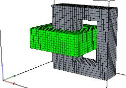
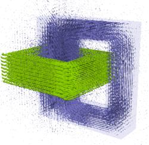
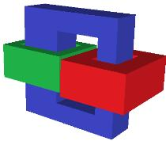
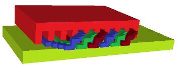
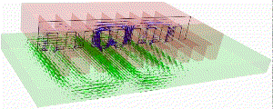
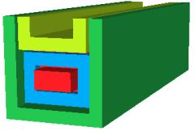
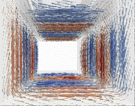
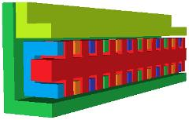
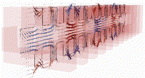

---


### 3d magnetostatic and eddy current calculations in the time domain using the finite difference method.  
&emsp; This package is designed as an easy-to-use tool for the initial stages of calculating electromagnetic fields in the low-frequency region with minimal requirements for the design geometry. Formulas, algorithms, programming - all this is the subject of experiments  and research.


### 1 Basic mathematical relationships
The information is provided in file [Readme.md](./doc/README.md) in the **/doc** directory.

### 2 Required Software 
The build and testing was done under _Windows_ (possibly _Linux_ too, but it hasn't been fully tested yet).  
-  [**VoxCad**](https://sourceforge.net/projects/voxcad/files/VoxCAD1000-x64.msi/download), ([here](https://sourceforge.net/projects/voxcad/files/VoxCad0992.tar.gz/download) is a version for  **Linux**) this voxel editor allows you to quickly create 3D images from rectangular parallelepipeds (cuboids). It is well suited for finite difference methods. All this combined makes it suitable for sketch calculations where precise geometric shapes are often not required. It should also be noted that geometric images in this editor can be accompanied by text data.  
-  [**gfortran**](https://www.equation.com/servlet/equation.cmd?fa=fortran) (with **gcc**). Version 15.2 for Windows was used or **Intel® oneAPI fortran compiler** [**ifort/ifx**](ttps://www.intel.com/content/www/us/en/developer/tools/oneapi/fortran-compiler-download.html).  
- **make**  for build;  
- [**ParaView**](https://www.paraview.org/)  to display calculation results in **vtk** format files.  
&emsp; For more information, see section 2.1.  

#### 2.1 Additions
&emsp; The _PARDISO_ library was used to solve the main equations. 
( [Intel® oneAPI Math Kernel Library PARDISO solver](https://www.intel.com/content/www/us/en/develop/documentation/onemkl-developer-reference-fortran/top/sparse-solver-routines/onemkl-pardiso-parallel-direct-sparse-solver-iface.html) ).  More precisely, you will need three files from this library: _mkl_rt.2.dll, mkl_core.2.dll, mkl_intel_thread.2.dll_. They can also be found on the [website](https://www.dllme.com). These files are also included in _Anaconda3_.  Since _Intel oneAPI Fortran_ is freely distributed, you can install it and specify the path to these files, as is done in the _Makefile_ provided here.    
&emsp; By default, _VoxCad_ stores domains geometry information (domains map) in compressed form (using **zlib** and **base64**). Two methods for unpacking the domain map are proposed here. You can use **Python** or **gcc**. When using **ifort/ifx**, it is necessary to specify the **Python** version, otherwise a runtime error will occur. When using **gfortran**, both methods are possible. In the source data, you must specify which **Python** version is installed. In the "solver" line, specify either **python=2** or **python=3** (to work with **Python**, you need to have the **zlib** and **base64** libraries installed). By default, **gcc** is used for decompression, meaning that the **python=0** parameter is set. For more information, see **doc/Quick_guide.pdf**.  
There are methods to avoid unpacking the domain map. In _VoxCad_ this data can be saved uncompressed **File->Export->Alternate VXC->Ascii**. You can use an analogue [**Voxcraft-viz**](https://github.com/voxcraft/voxcraft-viz) with higher-quality 3D graphics, which stores the domains map in _ASCII_ format by default.  In both cases, the file size increases several times.   

### 3. Repository Structure
Directory **/src**:  

- **ECMS3D.f90**   main program;   
* **m_vxc2data.f90**  module for sharing data obtained when converting data from a **VoxCad** file;  
* **vxc2data.f90**  program for converting data from a **VoxCad** file;   
* **vxc2data_ifort.f90**  program for converting data from a **VoxCad** file for **ifort** compiler;   
* **solvers.f90**  linear equation solver using [_BiCGSTABwr_](https://github.com/JNSresearcher/SOLVERS_BCGSTAB_GMRES) method ;  
* **/SPARSKIT2/ilut.f** an iterative solver _GMRES_ with incomplete LU factorization. The full version is available at [SPARSKIT](https://www-users.cse.umn.edu/~saad/software/SPARSKIT);  
* **utilites.f90**  contains routines for different tasks (convert a string to an array of words, convert to upper case, representation of a 3D image in **vtk**, converting a word to a number;  
* **m_fparser.f90** - parser for calculating functions specified in the lines of a **VoxCad** file. Adapted from source files, available from <http://fparser.sourceforge.net>;  
* **uncompress_zlib2.py** and **uncompress_zlib3.py** for create a temporary file with converted uncompressed data into ASCII for later processing (if **Python** is used);  
* **uncompress.cpp**  for create a temporary file with converted uncompressed data into ASCII for later processing (if **gcc** is used);  
* **/base64/base64.h** header file for  **uncompress.cpp**.  

&emsp;Files in **VoxCad** format with examples of tasks for calculations in the time domain:  

* **test_ms.vxc** magnetostatic testing task   
* **test_ms_ec.vxc** a test that performs a combined calculation of the interaction of magnetostatics and eddy currents.  
* **LIM-1s.vxc**, **LIM-Ge.vxc** examples with a linear induction machines.  

&emsp; Files in **VoxCad** format with examples for calculating eddy currents from the previous version of [_EC3D_](https://github.com/JNSresearcher/eddy_currents_3d)  but in a new format (while all functionality is preserved):  

* **compare_to_Elmer.vxc**, **compare_to_Agros.vxc**, **ec_src_moveXYZ_hole.vxc**, **LIM.vxc** ;  

Directory **/doc**:   

* **Validations.pdf** - results of validations  
* **Quick_guide.pdf** - quick guide to preparing data for calculations  
* **README.md** - basic mathematical relationships  

**Makefile**  creating an executable file using **make**.  


### 4. Build  
&emsp; To build the  executable file **ECMS3D.exe**, should be configure the **makefile**. The executable file can be created using the **gfortran** or **ifort** compilers. To configure, you need to comment/uncomment the corresponding lines, for example, for  use **gfortran**:   
```
        F90 = gfortran
        CC  = gcc 
        
        # F90=ifort
        # F90=ifx 
```  
&emsp; Type **make** at the command prompt and run.  


### 5. Launch of calculation  
&emsp; At first, on need to save the data, for example **example.vxc**, to a working file named **in.vxc** in the same directory as the **ECMS3D.exe** executable.  
Next run the executable file: **ECMS3D.exe**. As a result, output files will be created: with extensions  **vtk**. 

### 6. Output information
&emsp; The calculation results are written to files with the extension **vtk**, which are located in the directory **/out**, where **out** - the name that is specified in the source data (this name is set by default). The following sets of files are generated:  
&emsp; **field_\*.vtk**  for displaying a 3D field and **src_\*.vtk** - for displaying coils on an unstructured grid (only if the coils movement is specified). The number of files corresponds to the number of calculated points in time.

### 7. Validations and Quick guide.
 &emsp; Validation results and brief description located in files in the **/doc** folder in  files **Validations.pdf** and **Quick_guide.pdf**.  
 
### 8. Examples
 
### 8.1 Magnetostatic 

&emsp;Below in  <a id="Fig.1">Fig.1</a> are screenshots taken in  **VoxCAD** (geometry prepared for **ECMS3D**).   Geometry and data for calculation in **ECMS3D** are contained in the file **test_ms.vxc** in the directory **/src**

|&emsp;  | &emsp;&emsp;|
|  :-:                                     |:-:   |
|a) geometry                        |b) result calculate magnetic flux density  |

 
&emsp;&emsp;&emsp;&emsp; Fig.1. Screenshots of geometry and result of calculations   


### 8.2  interaction of eddy currents and magnetostatic.
&emsp; A coil and a conducting ring are located on the same core. A sinusoidal current is set in the coil. Below in  <a id="Fig.2">Fig.2</a> are screenshots taken in  **VoxCAD** (geometry prepared for **ECMS3D**).  The initial data for the task is in the file **test_ms_ec.vxc** in the directory **/src**.   

|&emsp; |&emsp; |
|  :-:                     |:-:   |
|a) geometry    |b) current density in coil, magnetic flux density |
|   |   in core and eddy current density  in conducting ring| 
  
&emsp; Fig.2. Images of magnetic flux density and eddy current density distribution calculated in **ECMS3D** and displayed in **Paraview**.   


### 8.3 Examples with a linear induction machines (**LIM**). 
&emsp; In linear induction machines, a magnetic field passing through a ferromagnet interacts with eddy currents in the conducting domains. These machines have a simple design that can be easily modeled using parallelepipeds. This allows for the evaluation of mathematical and software solutions by performing calculations for various linear induction machines. The examples below only consider the interaction of eddy currents and magnetostatics during the movement of conducting domains and are not related to the calculation of specific machine designs.   
&emsp;In all the examples below, a three-phase winding that produces a moving magnetic field in the positive **X**-direction is fed with a constant frequency current and placed in a magnetic core. The conducting region moves with constant velocity, first in the positive **x**-axis direction, then in the opposite direction. The velocity is specified in Euler coordinates. The frequency of the current  **f2** in the conducting region is proportional to the difference in the speeds of the moving field **Vs** of the three-phase winding and the speed **Ve** of the conducting environ: **$f2 \approx (Vs - Ve)/2\tau$**. If **Ve** reverses its sign, the frequency of the current in the conducting domain (and hence the speed of eddy currents) increases: **$f2 \approx (Vs + Ve)/2\tau$**. This is visible in the screenshots of the calculation results.   

### 8.3.1 Single-sided LIM with longitudinal magnetic flux
Based on materials published in [[1]](#b1). The initial data for the task is in the **LIM-1s.vxc** file.   
  
||  |
|  :-:                             |:-: |
| a) prepared geometry in **VoxCAD**|b) displaying the result in  **Paraview** |

&emsp;&emsp; Fig.3. Sscreenshots of geometry created by **VoxCAD** and calculation results obtained in **ECMS3D** and displayed in **ParaView**  

### 8.3.2 U-LIM  
&emsp; Based on materials published in [[2]](#b2). This machine has two U-shaped conductive domains. The outer conductive domain moves relative to the inductor (a core with a three-phase winding). The inner domain is stationary relative to the inductor. The initial data for the task is in the **LIM-Ge.vxc** file.   
  
|&emsp;&emsp;||| | 
|  :-:                            |:-:          |:-: | :-:                | 
| a) geometry U-LIM| b) eddy current density | c)longitudinal section of U-LIM| b) magnetic flux density |
|                        |         | | in a magnetic circuit                | 

&emsp;&emsp; Fig.4. Sscreenshots of geometry created by **VoxCAD** and calculation results obtained in **ECMS3D** and displayed in **ParaView**   
  
 

***
### Bibliography

<a id="b1">[1]</a> Linear induction motor. URL: https://en.wikipedia.org/wiki/Linear_induction_motor  
<a id="b2">[2]</a> G. Coquery, J.Sebillaud "Airport baggage handling system using U asynchronous linear motors", URL https://www.maglev.ir/eng/documents/papers/conferences/maglev2004/topic7/IMT_CP_M2004_T7_16.pdf


 ***
Autor <a href="mailto:JNSresearcher@gmail.com">J.Sochor</a>

 *** 
